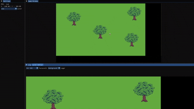

# Blossom

Blossom is a 2D game engine (soon to be 3D) written in C++ with Dear ImGui, GLFW, and stb_image as external dependencies. This project also features a custom math library.

The 2D engine has a fully working animation system, player controller, level editor, and a UI to work in. The engine also has levels and the ability to save new level layouts simply and efficiently as the tilemap system is done through binary files. The engine also provides a level editor allowing you to build maps based on what tilemap you have loaded.


## Previews


- TODO :
  - Allow the level editor to be traversed with clicking and dragging the mouse around and zooming in and out with the mouse wheel.
  - Figure out some optimizations for the level editor so that it isn't eating performance.
  - Add collisions to trees.

## Requirements
- Note: Make sure you are in the root of the project.
```xmake run```
